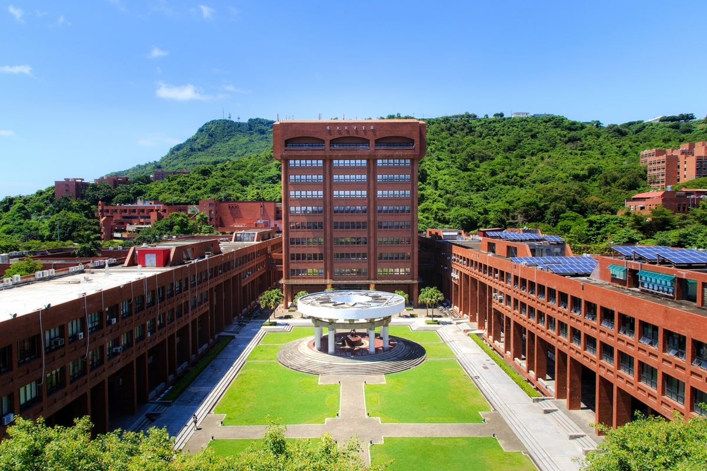
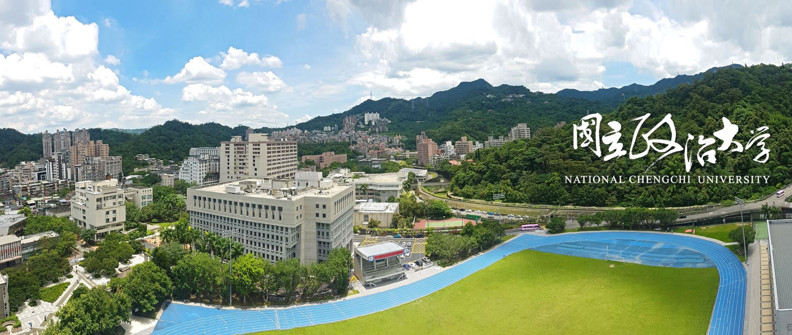

# NSYSU EE (SoC) M.S. | 中山電機 (系統晶片組) 碩士

## 2026 Spring

1. [Computer Architecture | 計算機結構][9.1]
2. [Open Source Prototype Systems and Applications | 開源式雛型系統與應用][9.2]
3. [SOPC Design Practice and FPGA System Design | SOPC設計實務及FPGA系統整合設計][9.3]
4. [Electronics I | 電子學(一)][9.4]

[9.1]: https://github.com/KaidenHsu/Computer-Architecture
[9.2]: https://github.com/KaidenHsu/Open-Source-Prototype-Systems
[9.3]: https://github.com/KaidenHsu/SOPC-System-Design
[9.4]: Courses/Masters/Semester1/ElectronicsI/

# NCCU CS (AI) B.S. | 政大資科 (人工智慧組) 學士

## 2022 Fall

1. [Calculus A 1 | 微積分甲][1.1]
2. [Computer Programming 1 | 計算機程式設計(一)][1.2]
3. [Computer Programming 1 Lab | 計算機程式設計(一)實驗][1.3]
4. [Introduction to Computer Science | 計算機概論][1.4]

[1.1]:Courses/Undergrad/Semester1/CalculusA1/
[1.2]:Courses/Undergrad/Semester1/ComputerProgramming1/
[1.3]:Courses/Undergrad/Semester1/ComputerProgramming1Lab/
[1.4]:Courses/Undergrad/Semester1/IntroductionToComputerScience/

## 2022 Spring

1. [Calculus A 2 | 微積分甲][2.1]
2. [Computer Programming 2 | 計算機程式設計(二)][2.2]
3. [Computer Programming 2 Lab | 計算機程式設計(二)實驗][2.3]

[2.1]:Courses/Undergrad/Semester2/CalculusA2/
[2.2]:Courses/Undergrad/Semester2/ComputerProgramming2/
[2.3]:Courses/Undergrad/Semester2/ComputerProgramming2Lab/

## 2023 Fall

1. [Data Structures | 資料結構][3.1]
2. [Discrete Mathematics | 離散數學][3.2]
3. [Object-oriented Programming | 物件導向程式設計][3.3]
4. [Object-oriented Programming Lab | 物件導向程式設計實驗][3.4]

[3.1]:Courses/Undergrad/Semester3/DataStructures/
[3.2]:Courses/Undergrad/Semester3/DiscreteMathematics/
[3.3]:Courses/Undergrad/Semester3/ObjectOrientedProgramming/
[3.4]:Courses/Undergrad/Semester3/ObjectOrientedProgrammingLab/

## 2023 Spring

1. [Advanced Mobile Communication Network | 進階行動通訊網路][4.1]
1. [Algorithms | 演算法][4.2]
2. [Digital System Labs | 數位系統實驗][4.3]
3. [Linear Algebra | 線性代數][4.4]
4. [Introduction to Digital System | 數位系統導論][4.5]

[4.1]:Courses/Undergrad/Semester4/AdvancedMobileCommunicationNetwork/
[4.2]:Courses/Undergrad/Semester4/Algorithms/
[4.3]:Courses/Undergrad/Semester4/DigitalSystemLab/
[4.4]:Courses/Undergrad/Semester4/LinearAlgebra/
[4.5]:Courses/Undergrad/Semester4/IntroductionToDigitalSystem/

## 2024 Fall

1. [Computer Architecture and Organization | 計算機結構與組織][5.1]
2. [Operating System | 作業系統][5.2]
3. [Mobile Communication Network | 行動通訊網路][5.3]
4. [Computational Thinking and Introduction to Artificial Intelligence | 計算思維與人工智慧應用導論][5.4]
5. [3D Game Programming | 3D 遊戲程式設計][5.5]

[5.1]:Courses/Undergrad/Semester5/ComputerArchitectureAndOrganization/
[5.2]:Courses/Undergrad/Semester5/OperatingSystem/
[5.3]:Courses/Undergrad/Semester5/MobileCommunicationNetwork/
[5.4]:Courses/Undergrad/Semester5/ComputationalThinkingAndIntroductionToArtificialIntelligence/
[5.5]:Courses/Undergrad/Semester5/3DGameProgramming/

## 2024 Spring

1. [Data Science | 資料科學][6.1]
2. [Database System | 資料庫系統][6.2]
3. [Distributed Systems | 分散式系統][6.3]
4. [Introduction to Artificial Intelligence | 人工智慧概論][6.4]
5. [Introduction to Data Communications and Networking | 網路與通訊概論][6.5]
6. [Natural Language Processing | 自然語言處理][6.6]

[6.1]:Courses/Undergrad/Semester6/DataScience/
[6.2]:Courses/Undergrad/Semester6/DatabaseSystem/
[6.3]:Courses/Undergrad/Semester6/DistributedSystems/
[6.4]:Courses/Undergrad/Semester6/IntroductionToArtificialIntelligence/
[6.5]:Courses/Undergrad/Semester6/IntroductionToDataCommunicationsAndNetworking/
[6.6]:Courses/Undergrad/Semester6/NaturalLanguageProcessing/

## 2025 Fall

1. [Information Visualization | 資訊視覺化][7.1]
2. [Virtual Reality Haptic Interactions | 虛擬實境與觸覺回饋互動][7.2]
3. [Data Mining | 資料採掘][7.3]

[7.1]:Courses/Undergrad/Semester7/InformationVisualization/
[7.2]:Courses/Undergrad/Semester7/VirtualRealityHapticInteractions/
[7.3]:Courses/Undergrad/Semester7/DataMining/

## 2025 Spring

1. [Electronic Circuits | 電子電路學][8.1]
2. [General Physics (II) | 普通物理學(二)][8.2]
3. [Graph Theory | 圖形理論][8.3]
4. [Introduction to Software Engineering | 軟體工程概論][8.4]
5. [Video Compression | 視訊壓縮][8.5]

[8.1]:Courses/Undergrad/Semester8/ElectronicCircuits/
[8.2]:Courses/Undergrad/Semester8/GeneralPhysics(II)/
[8.3]:Courses/Undergrad/Semester8/GraphTheory/
[8.4]:Courses/Undergrad/Semester8/IntroToSWE/
[8.5]:Courses/Undergrad/Semester8/VideoCompression/

